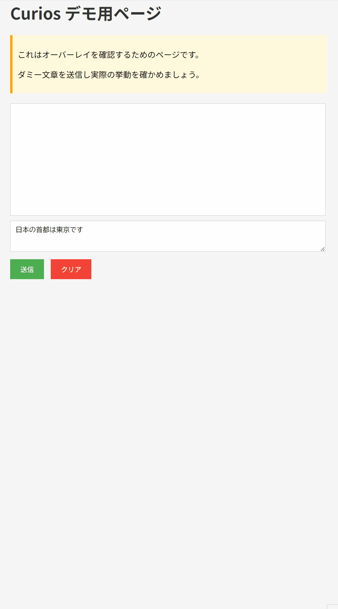

# Curios

🇯🇵 日本語版 → [README.md](./README.md)

> Connect your curiosity with AI.

## Concept
Curios is an **open AI integration framework designed to allow users to freely embed, modify, and experiment with AI check functions**.  
It’s built as a browser extension that performs AI analysis on text within web pages, and the fact-checking feature is just **one example** of its potential.

Through this framework, you can bring your curiosity to life by experimenting with various AI models, logics, and building your own unique UI.

## From the Developer
This project was conceived and designed by me (Jelly),  
and almost all the implementation, refinement, and adjustment were shaped with the help of AI assistants.

I am a developer with no prior knowledge.

That’s why I use tools like AI,  
learning, trying, and transforming ideas into reality as I go.

Curios is one example of such practice.

## Current Limitations and Notes

- The models are trained up to a certain point (e.g., mid-2024) and may not cover the latest events or breaking news.
- Web search results are not always the latest or most accurate, and due to biases or retrieval errors, AI may provide incorrect assessments.
- **Therefore, always treat AI outputs as reference only and perform human verification and additional research for critical decisions.**

⚠️ **Important: Check your API subscription details**

Using Google Gemini API and Google Custom Search API requires an account on Google Cloud or Google AI Studio.  
Free tiers, pay-as-you-go, and monthly plans differ by service and configuration.  
**Please ensure you check the official documentation on limits and pricing before obtaining and using API keys to avoid unexpected charges.**

Examples:
- https://cloud.google.com/vertex-ai/pricing
- https://developers.google.com/custom-search/v1/overview

## Demo

Below is a demo of Curios in action.



## Overview
Currently, Curios operates as a browser extension that performs fact-checking on web page text using Google Generative AI (gemini-2.5-pro, gemini-2.5-flash, etc.) and Google Custom Search API.  
It verifies the accuracy of user-selected or long-pressed text and overlays the results on the web page.

## Notes
While Curios comes with a fact-checking demo,  
by modifying the server-side prompts (`server.js`),  
you can freely change it to summarization, translation, sentiment analysis, and other AI check functions.

**Examples of possible extensions (user customizations)**
✅ Article truth analysis → Bias detection or fake news handling  
✅ Product review analysis → Auto-summary or sentiment scoring  
✅ SNS support → Harassment detection or misinformation warnings  
✅ Code assistance → AI explanations or refactoring suggestions for selected code  
✅ Educational support → Simplified rephrasing or quiz generation from text

## Tech Stack
- **Frontend**: React, Vite  
- **Backend**: Node.js (Express.js)  
- **AI**: Google Generative AI (e.g., gemini-2.5-pro)  
- **Web Search**: Google Custom Search API  
- **Browser Extension**: Manifest V3

## Setup Instructions

### 1. Clone the repository
```bash
git clone [repository URL]
cd curios
```

### 2. Install dependencies
```bash
npm install
```

### 3. Set environment variables
Create a `.env` file and add:
```
GEMINI_API_KEY=your_Gemini_API_key
CUSTOM_SEARCH_API_KEY=your_Custom_Search_API_key
CSE_ID=your_Custom_Search_Engine_ID
```

### 4. Start the backend server
```bash
npm start
```

### 5. (Optional) Start the frontend development server
```bash
npm run dev
```

### 6. Install the browser extension
1. Go to `chrome://extensions`  
2. Turn on Developer Mode  
3. Click “Load unpacked” and select the project root

## Customization & Experimentation
- `server.js`: Change AI models, prompts, API integrations  
- `content.js`: Modify event detection, overlay UI  
- `App.jsx`: Modify popup UI, data transmission

**Example for changing AI model**
Edit the following in `server.js`:
```js
const model = genAI.getGenerativeModel({ model: "gemini-2.5-pro" });
```
For the latest model names, refer to Google Gemini API top page (https://ai.google.dev/) or Google Cloud Vertex AI docs (https://cloud.google.com/vertex-ai/docs/generative-ai).

## Author
Jelly

- Bluesky: [https://bsky.app/profile/jellycotton.bsky.social]

※ The project icon was created using multiple AI tools including ChatGPT, Gemini, and Copilot.  
※ It is released under OSS/non-commercial assumptions; for commercial use or redistribution, please check the terms and conditions of each AI service.

## License
Copyright (c) 2025 Jelly  
Licensed under the MIT License
