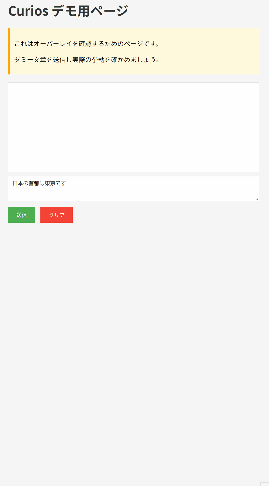

# Curios

> あなたの好奇心を、AIとつなぐ。

## コンセプト
Curiosは、**ユーザーが自由にAIチェック機能を組み込み、改造・実験できることを前提とした、オープンなAI連携フレームワーク**です。
Webページ上のテキストに対してAIによる分析を行うブラウザ拡張機能として設計されており、ファクトチェック機能はその可能性を示す**一例**として実装されています。

このフレームワークを通じて、様々なAIモデルやロジックを試したり、独自のUIを構築したりすることで、あなたの好奇心を形にすることができます。

## 開発者の立場として
このプロジェクトは、私（じぇりー）が着想・構想を得たのち、
実装・整備・調整のほとんどをAIアシスタントの助けを借りて形にしました。

私は知識のない開発者です。

だからこそ、AIという道具を使い、
学びながら、試しながら、
自分のアイデアを現実化するスタンスでこれからも進みます。

Curiosはその実践例のひとつです。

## 現在の限界と注意点

- モデルの知識は学習時点（例: 2024年中頃）のものであり、最新の出来事や速報には対応していない場合があります。
- Web検索結果も常に最新かつ正確な情報とは限らず、情報の偏りや取得ミスにより、AIが誤った判定を行うことがあります。
- **このため、AIの出力結果はあくまで参考情報として扱い、重要な判断には必ず人間の確認・追加調査を行ってください。**

⚠️ **重要: API契約内容の確認を推奨**

Google Gemini APIおよびGoogle Custom Search APIの利用には、Google CloudやGoogle AI Studioのアカウント契約が必要です。
利用量に応じた無料枠・従量課金・月額課金などの条件は、各サービスの契約プラン・設定によって異なります。
**誤って予想外の課金が発生しないよう、APIキーの取得・利用前に必ず公式ドキュメントで上限・料金プランをご確認ください。**

例:
- https://cloud.google.com/vertex-ai/pricing
- https://developers.google.com/custom-search/v1/overview

## デモ

以下はCuriosの動作デモです。



## 概要
現在のCuriosは、Google Generative AI (gemini-2.5-pro, gemini-2.5-flash など) とGoogle Custom Search APIを用いてWebページ上のテキストのファクトチェックを行うブラウザ拡張機能として動作します。
ユーザーが選択したテキストや長押ししたテキストについて情報の真偽を検証し、その結果をWebページ上にオーバーレイ表示します。

## 補足
Curiosはファクトチェックデモを例示として搭載していますが、
サーバー側（server.js）のプロンプトを変更することで、
要約・翻訳・感情分析など他のAIチェック機能に自由に改造可能です。
詳細はユーザー側でお楽しみください。

**可能性の例（ユーザー改造による拡張例）**
✅ 記事の真偽分析 → 偏向検出やフェイクニュース対応へ  
✅ 商品レビュー解析 → 自動要約・感情スコア付与  
✅ SNS補助 → ハラスメント検出・誤情報警告  
✅ コード補助 → コード選択部をAIで解説・リファクタリング提案  
✅ 教育支援 → テキストを分かりやすく言い換え、クイズ化  

## 技術スタック
- **フロントエンド**: React, Vite
- **バックエンド**: Node.js (Express.js)
- **AI**: Google Generative AI (例: gemini-2.5-pro)
- **Web検索**: Google Custom Search API
- **ブラウザ拡張機能**: Manifest V3

## セットアップ方法

### 1. プロジェクトのクローン
```bash
git clone [リポジトリのURL]
cd curios
```

### 2. 依存関係のインストール
```bash
npm install
```

### 3. 環境変数の設定
`.env` ファイルを作成し、以下を記入してください。
```
GEMINI_API_KEY=あなたのGemini_APIキー
CUSTOM_SEARCH_API_KEY=あなたのCustom_Search_APIキー
CSE_ID=あなたのCustom_Search_Engine_ID
```

### 4. バックエンドサーバーの起動
```bash
npm start
```

### 5. フロントエンド開発サーバーの起動 (任意)
```bash
npm run dev
```

### 6. ブラウザ拡張機能のインストール
1. `chrome://extensions` にアクセス
2. デベロッパーモードをON
3. 「パッケージ化されていない拡張機能を読み込む」でプロジェクトルートを選択

## カスタマイズと実験
- `server.js`: AIモデル、プロンプト、API連携変更
- `content.js`: イベント検知、オーバーレイUI変更
- `App.jsx`: ポップアップUI、データ送信変更

**AIモデルの変更例**
`server.js` 内の以下部分を編集してください。
```js
const model = genAI.getGenerativeModel({ model: "gemini-2.5-pro" });
```
最新モデル名は Googleの公式Gemini APIトップページ（https://ai.google.dev/）または Google Cloud Vertex AIドキュメント（https://cloud.google.com/vertex-ai/docs/generative-ai）を参照してください。

## 開発・著作
じぇりー（Jelly）

- Bluesky: [https://bsky.app/profile/jellycotton.bsky.social]

※ 本プロジェクトのアイコン画像は、ChatGPT、Gemini、Copilotなど複数のAIツールを用いて作成したオリジナルのAI生成画像です。  
※ 本プロジェクトのアイコン画像はOSS・非商用利用を前提として公開しており、商用利用や再配布時には各AIサービスの利用規約および商用可否を必ず確認してください。

## ライセンス
Copyright (c) 2025 じぇりー (Jelly)  
Licensed under the MIT License
